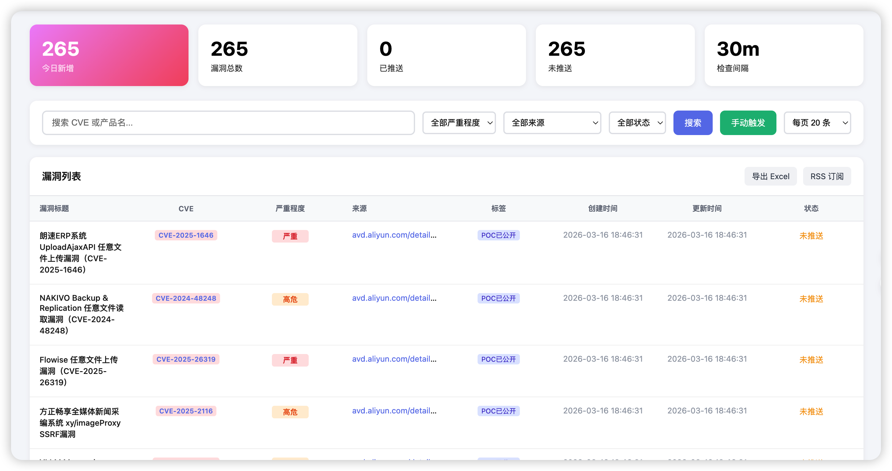
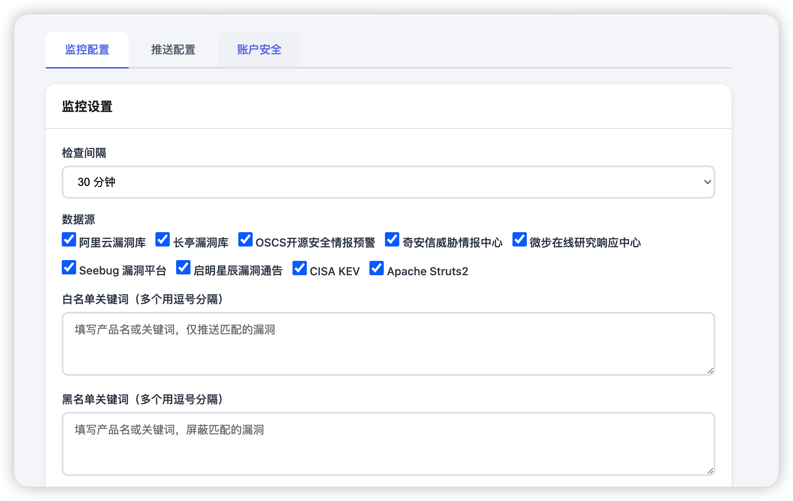
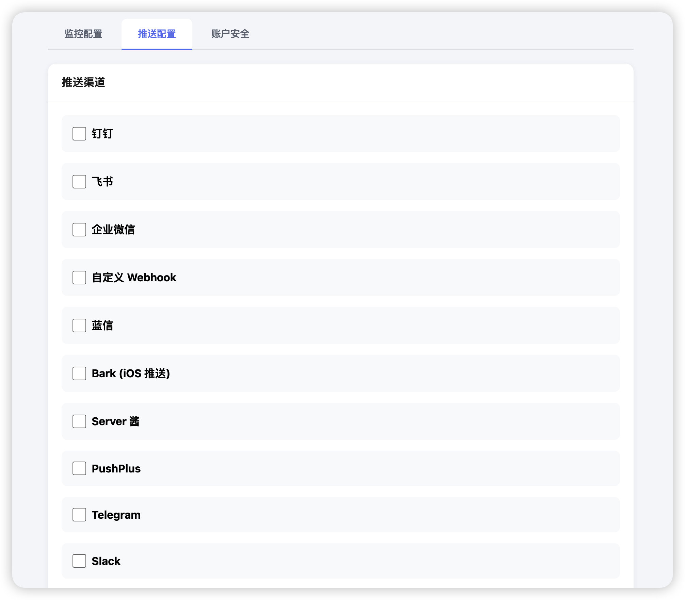
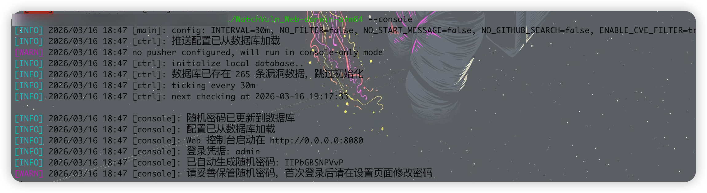
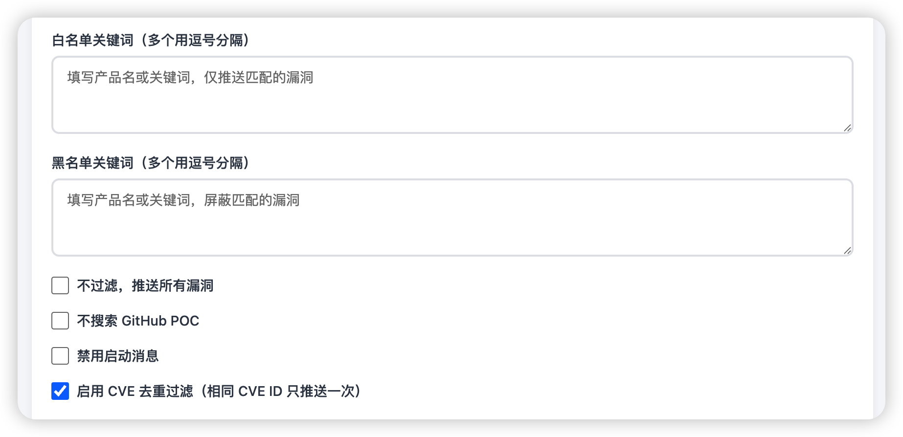

# WatchVuln_Web

WatchVuln 的二开版本，在原版命令行工具的基础上增加了 Web 管理控制台，提供可视化配置界面，方便用户管理漏洞监控和推送设置。

## 功能特性

### Web 管理控制台
- **可视化配置界面**：通过 Web 页面配置所有功能，无需修改配置文件
- **实时监控状态**：查看漏洞库数量、最近更新时间、下次检查时间
- **手动触发检查**：一键触发漏洞检查，无需等待定时任务
- **操作日志**：记录所有配置变更和推送记录



### 数据源

支持以下漏洞信息源：

| 数据源 | 说明 |
|-------|------|
| 阿里云漏洞库 (AVD) | 高危/严重漏洞 |
| 长亭漏洞库 | 高危/严重漏洞（中文标题） |
| OSCS 开源安全情报 | 高危/严重漏洞（预警标签） |
| 奇安信威胁情报中心 | 高危漏洞（特定标签） |
| 微步在线 | 高危/严重漏洞 |
| Seebug 漏洞平台 | 高危/严重漏洞 |
| 启明星辰 | 高危/严重漏洞 |
| CISA KEV | 全部漏洞 |
| Apache Struts2 | 高危/严重漏洞 |



### 推送渠道

支持多种推送方式：

- 钉钉群机器人
- 飞书群机器人
- 微信企业版
- Server 酱
- PushPlus
- Telegram Bot
- Slack Webhook
- Bark
- 蓝信
- 自定义 Webhook



## 快速开始

### 直接运行

```bash
# 运行（默认监听 0.0.0.0:8080）
./WatchVuln_Web-windows-amd64.exe --console
```

首次启动会生成随机登录密码，请注意查看日志。



## 配置说明

启动后访问 `http://localhost:8080`，使用 admin 账号登录（每次启动密码会随机生成，见日志）。


### 监控配置
- **检查间隔**：设置漏洞检查周期（15分钟/30分钟/1小时/2小时/6小时）
- **数据源选择**：勾选需要监控的漏洞源
- **关键词过滤**：设置白名单/黑名单关键词过滤
- **CVE 过滤**：开启后多个源的同一 CVE 只推送一次



### 推送配置

配置推送渠道的访问凭证，每个渠道可独立开启/关闭。

### 代理配置
支持 HTTP/SOCKS5 代理，用于访问需要代理的数据源。

## 配置数据存储

配置信息存储在 SQLite 数据库中（`vuln_v3.sqlite3`），包括：
- 登录凭据（bcrypt 加密）
- 监控配置（数据源、检查间隔等）
- 推送渠道配置
- 代理设置

## 相关链接

- 原版项目：[zema1/watchvuln](https://github.com/zema1/watchvuln)
- 数据来源：阿里云 AVD、长亭漏洞库、OSCS、奇安信、微步、Seebug、启明星辰、CISA KEV、Apache Struts2

## License

MIT License
